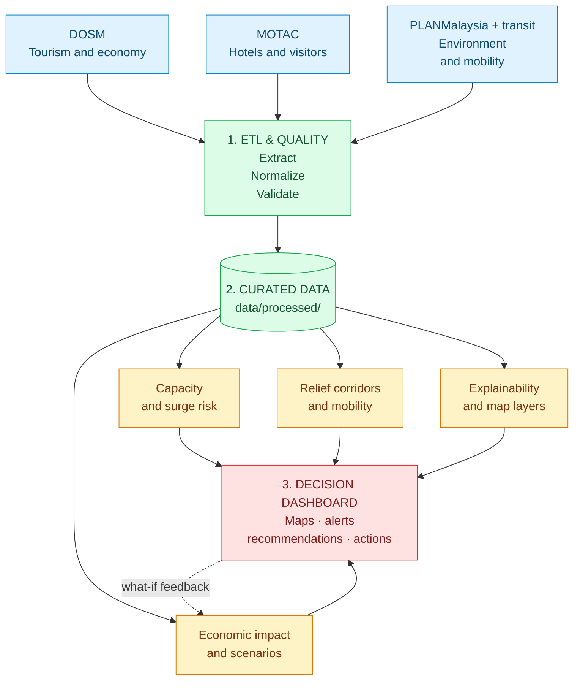
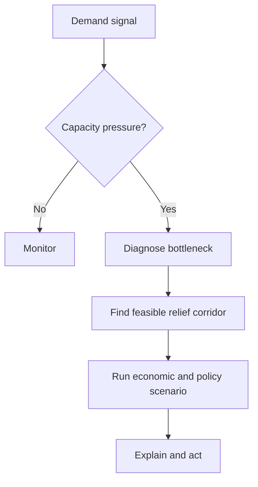
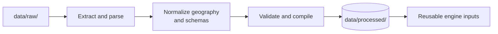
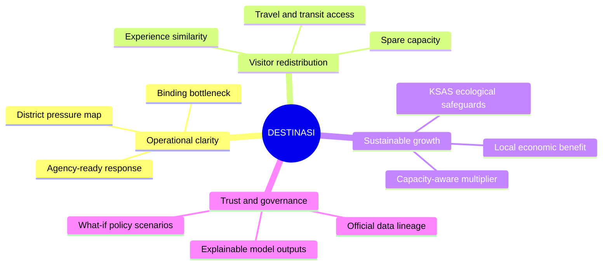
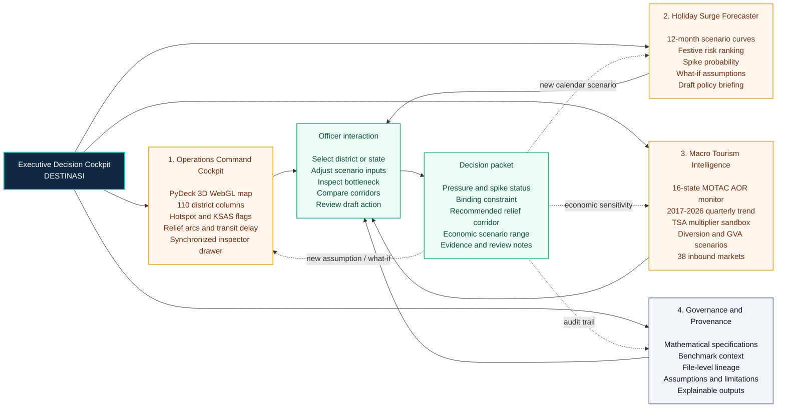

# DESTINASI Architecture

DESTINASI turns official tourism, mobility, environmental, and economic data into an explainable operational decision: **observe pressure, diagnose the constraint, test a relief corridor, and act early**.

## Architecture at a Glance

### How to read the architecture

The platform moves from evidence to action in three simple stages:

1. **Sources and ETL** provide and prepare official tourism, hotel, transport, environmental, and destination information.
2. **The curated data layer** stores consistent datasets that feed four focused branches: capacity and surge risk; relief corridors and mobility; economic impact and what-if scenarios; and explainability and map layers.
3. **The decision dashboard** brings those branches together as maps, alerts, recommendations, and actions for tourism officers.

The feedback arrow represents scenario testing: officers can change an assumption, such as visitor redistribution or transport support, and immediately review the expected operational and economic effect.

## Layer Responsibilities

| Layer | Purpose | Report output |
| --- | --- | --- |
| **Data sources** | Bring together official tourism, hotel, mobility, environmental, and destination signals. | Traceable evidence base |
| **ETL and data quality** | Parse, normalize, validate, and compile consistent district and state datasets. | Reusable analytical inputs |
| **Decision engines** | Calculate capacity, forecast surges, score corridors, estimate economic impact, and explain results. | Ranked and defensible interventions |
| **Decision dashboard** | Present maps, risk alerts, scenarios, recommendations, and policy actions. | Faster operational coordination |

## Decision Path

## Runtime Flow

1. The deployment runner starts `app.py`.
2. `app.py` resolves the repository root and executes `dashboard/app.py`.
3. The dashboard loads curated files from `data/processed/` and optional raw inputs from `data/raw/`.
4. Streamlit navigation opens one of four decision views:
     - **Operations Command Cockpit:** live pressure, 3D district map, relief corridors, and intervention scenarios.
     - **Holiday Surge Forecaster:** forward demand, saturation risk, and pre-emptive advisory signals.
     - **Macro Tourism Intelligence:** hotel trends, visitor spending, multipliers, and redistribution economics.
     - **Governance & Methodology:** provenance, assumptions, benchmarks, and transparent methods.
5. The selected view calls the relevant domain engines in `src/`.
6. Engine outputs become maps, charts, alerts, recommendations, economic scenarios, and policy actions.

## Data Preparation Flow

The preparation pipeline is separate from the dashboard runtime, which keeps the live application fast and the data lineage inspectable.

The main compilation entrypoint is `src/build_comprehensive_datasets.py`. It writes normalized outputs such as district visitation, attraction inventories, origin-destination matrices, expenditure shares, hotel occupancy series, international profiles, and travel-demand signals to `data/processed/`.

## What the Platform Produces

## Domain Engine Responsibilities

| Engine | Responsibility | Main dashboard use |
| --- | --- | --- |
| `carrying_capacity_engine.py` | Finds the binding accommodation, transport, water, ecological, attraction, or social constraint. | Operations alerts and intervention thresholds |
| `recommender_matcher.py` | Scores feasible nearby destinations by experiential similarity, accessibility, capacity, and economic need. | Relief corridor recommendations |
| `predictive_spike_engine.py` | Estimates holiday demand and district saturation risk. | Holiday Surge Forecaster |
| `economic_impact_model.py` | Estimates local economic effects of redirecting visitors. | Macro Tourism Intelligence and what-if analysis |
| `economic_multiplier_engine.py` | Applies DOSM input-output multiplier data. | Economic impact calculations |
| `aor_engine.py` | Loads and summarizes hotel average occupancy rates. | Hotel and state trend analysis |
| `traffic_engine.py` | Scores road and transit accessibility. | Route and corridor comparisons |
| `xai_engine.py` | Explains model outputs and simulates interventions. | Explainable recommendations and policy scenarios |
| `map_components.py` | Builds the PyDeck map, demand layers, transit paths, and KSAS overlays. | Operations Command Cockpit |

## System Boundaries

- **Inputs:** packaged government datasets, reference data, and optional external data extraction.
- **Processing:** Python ETL scripts and focused domain engines using pandas, NumPy, and project-specific models.
- **Presentation:** Streamlit with Altair charts and PyDeck/WebGL geospatial layers.
- **Optional AI:** Hugging Face-backed policy synthesis through the dashboard's BYOK token flow; built-in templates remain available without a token.
- **Deployment:** local Streamlit, Docker, Streamlit Community Cloud, or another container platform.

## Related Documentation

- [Project overview and quick start](README.md)
- [Technical and econometric appendix](TECHNICAL_APPENDIX.md)
- [Application entrypoint](app.py)
- [Dashboard application](dashboard/app.py)

## 5. Executive Decision Cockpit

The DESTINASI interface turns a difficult tourism-management question into a visible
decision loop: **detect pressure, diagnose the constraint, test a relief corridor,
estimate the consequence, and prepare an accountable action.** The figure below is a
report-ready view of the dashboard experience when the live Streamlit application is
not available to the reader.

**Figure 5. Executive Decision Cockpit.** The four views share a common selected
district, scenario context, and evidence base. An officer can move from a modelled
hotspot to its binding bottleneck, test a feasible alternative, inspect the estimated
economic effect, and retain the data lineage behind the recommendation. The cockpit
supports planning and review; it does not measure live crowds, command agencies, issue
legal orders, or guarantee visitor behaviour.

### Interaction narrative for the report

1. **Observe:** the Operations Command Cockpit highlights a modelled hotspot on the
    3D map and exposes demand, sustainable capacity, headroom, and the binding subsystem.
2. **Anticipate:** the Holiday Surge Forecaster tests festive-calendar scenarios and
    ranks districts by modelled saturation and spike risk up to 12 months ahead.
3. **Redistribute:** the officer compares the Top 3 feasible relief corridors using
    experience similarity, accessibility, spare capacity, community opportunity, and
    ecological safeguards.
4. **Quantify:** the Macro Tourism Intelligence view estimates output and GVA ranges
    for a proposed diversion using the selected TSA multiplier and capacity damping.
5. **Account:** Governance & Provenance keeps the equations, assumptions, benchmark
    context, and source lineage attached to the decision packet for review.

> **Evidence boundary:** all pressure, capacity, forecast, corridor, and Ringgit
> values shown by the cockpit are modelled planning estimates unless explicitly marked
> as an official source observation. The interface is designed to make that distinction
> visible rather than hide it.
