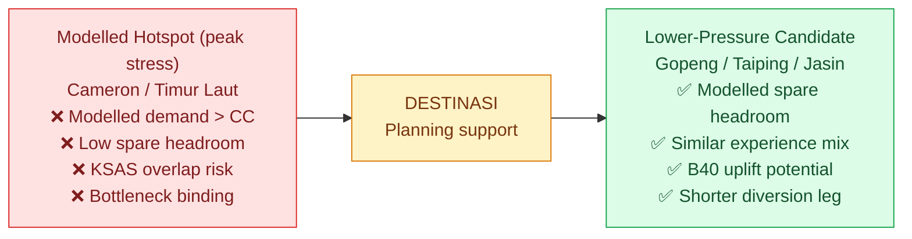

# DESTINASI: Smart Tourism Dispersal & Local Economic Rebalancing
### *DOSM Datathon 2026 — Ministry of Tourism, Arts and Culture (MOTAC) & Department of Statistics Malaysia (DOSM)*

[](http://localhost:8501)
[](https://www.python.org/downloads/)
[](https://opensource.org/licenses/MIT)
[]()
[]()
[]()
[]()

> 📘 **Looking for deep econometrics, mathematical proofs, or API schemas?**  
> We have separated all academic formulas, Leontief matrices, and system architecture details into the [Technical & Econometric Appendix](TECHNICAL_APPENDIX.md).  
> For the data → intelligence → action flow, see the [Architecture](ARCHITECTURE.md).

---

## 🌟 What is DESTINASI? (The Big Idea)

**DESTINASI** is a planning-support prototype for Malaysian tourism officers, town councils, and transport authorities.

Its aim is to **help prioritize holiday overcrowding risks in well-known hotspots, flag overlap with nature reserves, and shortlist similar lower-pressure alternatives for further review.** It does not control traffic, enforce closures, or issue binding orders.


> All demand, capacity, and Ringgit figures are modelled estimates, not live measurements. See CAN/CANNOT box below.

---

## 🚦 The Real-World Problem We Are Addressing

During school breaks and festive long weekends (Hari Raya, Chinese New Year, Deepavali, Merdeka):

1. **Peak-period concentration**: Modelled hotspot demand can exceed sustainable capacity (`D_peak / CC_sust > 1.0`) in places such as Cameron Highlands, Timur Laut (George Town area), Melaka Tengah, and Port Dickson. This is a capacity-stress statement, not a national volume share. For context, DOSM DTS state data in this repo (`data/processed/dts_timeseries_2018_2025.csv`) show the Top 5 states hold ~51.2% of domestic visits in 2024 (~52.1% in 2025); the 110-district modelled `daily_demand_peak` Top 5 hold ~11.0% (`data/processed/destinations_master.csv`). Penang + Melaka + Pahang states combined are ~23% — even if an entire state were one hotspot, it would not be 80%.
2. **Strain at peaks**: Winding mountain roads, bridges, water/waste systems, and bins can come under pressure during surges. Impacts vary by bottleneck (accommodation, transport, attraction space, water/waste, ecology, social) and are modelled via the Cifuentes lower-envelope, not measured live.
3. **Uneven benefits**: Nearby districts with similar heritage/nature/food assets show modelled spare headroom (`capacity_gap > 0.10`) and higher HIES poverty rates, indicating potential — not proven — grassroots uplift if reviewed diversions occur.

### 📌 Overtourism and hotspot — operational definitions in this project

> Use these meanings when reading the map, tables, and memos. They are modelled planning flags, not observed crowd counts or legal orders.

* **Overtourism (DESTINASI sense)** = a district in modelled **overcapacity**: peak demand exceeds sustainable capacity, i.e. `C_d = D_peak / CC_sust > 1.0`, so `excess = max(0, D - CC) > 0` and `is_overcapacity = True` (`src/carrying_capacity_engine.py:66-125`). It does **not** mean we measured crowds, surveyed residents, or declared an emergency.
* **Sustainable capacity** = `CC_sust = min(CC_accom, CC_trans, CC_attr, CC_water, CC_eco, CC_soc)` (Cifuentes lower-envelope). The binding bottleneck is named (e.g. `Accommodation Inventory`, `Ecosystem & Slope Tolerance`). Companion metrics: `pressure% = D/CC×100`, `gap = 1 - D/CC`.
* **Hotspot (analytical)** = district with modelled `stress ≥ 100%` (`C_d ≥ 1.0`) on baseline peak or a selected scenario month. Only hotspots are candidates for diversion review. Severity within hotspots comes from `src/predictive_spike_engine.py:295-307`:
  * `≥130%` → `CRITICAL SPIKE`, planning lead `14 days` (classifier floored to `≥94%` spike probability);
  * `100–130%` → `ELEVATED RUSH`, lead `7 days` (floored to `≥78%` if `≥105%`);
  * `<100%` → `NORMAL FLOW`, lead `3 days`.
* **Stressed / watch (not a hotspot)** = `80–<100%` (orange on map). **Headroom** = `<80%` (white/green). Map bands match FAQ Q1; the capacity engine additionally labels `<70% underutilized`, `70–85% healthy`, `85–100% high pressure` for context — README bands govern the hotspot call.
* **A hotspot call needs four fields**, not one ratio: (1) `stress%`, (2) `spike P%` with thresholds `P<40% / 40–70% / ≥70%` (`TECHNICAL_APPENDIX.md:226-228`), (3) `excess pax/day` + `65% diversion quota` illustration, (4) binding constraint + KSAS overlap (`D > CC_eco` amplifies review). Example: `Cameron Highlands 133% + P 94% + +2,800 pax/day + eco binding + KSAS overlap` is stronger than `101% alone`.
* **Hotspot (UI sense)** = any of the 110 districts you select as origin for what-if analysis. Tests allow all 110 as origins; the analytical label above still decides whether redistribution review is warranted.

---

## 💡 How DESTINASI Helps (In Plain English)

DESTINASI is a **planning screening aid, not an air-traffic controller**:

1. **🗺️ 3D Modelled-Stress Map**  
   Interactive 3D map for 110 districts (Peninsular, Sabah, Sarawak). Column height/colour shows modelled `capacity_stress = D_peak / CC_sust`, not live crowds. Red `>=100%`, orange `80-100%`, white/green `<80%` spare headroom.

2. **🎯 Similarity-Based Shortlister**  
   If Cameron Highlands is modelled as full, DESTINASI shortlists feasible candidates by 5-pillar cosine + Jaccard POI hybrid (`alpha=0.60`) and Weighted Sum Model. It ranks *similar* mixes — it cannot guarantee the *exact same* experience.

3. **🛣️ Estimated Routes & Rail Option**  
   Estimated road distance/ETA via OSRM/Valhalla free routing or terrain heuristic + LLM/PLUS sensor tint when offline. Live `duration_in_traffic` only when a Google Maps key with internet is supplied. KTMB ETS highlighted only where the corridor file indicates rail viability.

4. **🛡️ KSAS Overlap Flag (Nature Guardian)**  
   Overlays cached PLANMalaysia KSAS rasters (Peninsular/Borneo PNGs) or live i-Plan WMS when online. Red/white disk flags spatial overlap with sensitive zones — a review prompt, not a damage prediction or enforcement.

5. **💰 Estimated Local-Economy Effects (DOSM I-O)**  
   Estimates gross output and GDP effects using DOSM 2019-2021 symmetric I-O Leontief inverses (124 sectors), DTS-weighted composite tourism multipliers, and capacity damping. See DTS/Type I/Type II box below. Figures are scenario estimates with elastic-supply and fixed-coefficient assumptions.

6. **🤖 Drafting Assistant**  
   Produces *draft* circulars/advisories/dispatch notes from deterministic templates, optionally rephrased by Hugging Face BYOK LLM (`DeepSeek-V4.1-Flash` + fallbacks). All outputs require officer review; they are not civil-service-approved orders.

### ✅ What this CAN vs ❌ CANNOT achieve

| CAN (grounded) | CANNOT (out of scope) |
|---|---|
| Rank 110 districts by modelled stress and binding bottleneck | Measure live visitors, hotel occupancy, water levels, or traffic |
| Shortlist Top 3 feasible similar corridors (`gap>10%`, `D<CC_eco`, `≤350 km`, prefer `≤180 km`) | Guarantee hotel rooms, road times, or visitor satisfaction |
| Estimate Ringgit output/GDP for 1,000-8,000 diverted visitors under stated multipliers | Predict exact Ringgit that will reach specific shops/homestays |
| Provide 12-month calendar-driven scenarios and what-if sensitivity | Forecast actual arrivals; ML is trained on 504 calendar-capacity scenarios, not validated daily history |
| Flag KSAS overlap and draft memos for review | Prevent erosion, close areas, price roads, or command agencies |

### 📊 DTS vs Type I vs Type II — read this before quoting multipliers

* **DTS (Domestic Tourism Survey) = weights, not a multiplier.** `data/processed/dts_expenditure_shares.csv` (2024: shopping ~37.4%, F&B ~16.2%, fuel ~12.7%, accommodation ~11.2%, transport ~6.7%). Code maps these to I-O commodities in `src/economic_multiplier_engine.py:55-64` (e.g. retail ~45.2% incl. pre-trip/visited-household split, F&B ~20.1%, fuel ~12.7%, accom ~11.2%). Composite tourism multiplier = `Σ s_k · M_k`.
* **Type I output (direct + indirect turnover):** column sum of Leontief inverse `L=(I-A)⁻¹`. Default 2021 composite **1.7525×** (`2019: 1.7624×, 2020: 1.8272×`) from `data/processed/dosm_io_multipliers.json`. Retail-only 2021 is 1.5428× — do not quote retail as tourism.
* **GVA/GDP (net, ≤1.0):** `v·L`. Default 2021 **0.8151×** (`2019: 0.8154×, 2020: 0.8362×`). This is the GDP contribution per RM1 final demand, not turnover. Do not conflate 1.75× turnover with GDP.
* **Type II output (direct + indirect + induced household):** `(I-A*)⁻¹` with closed household. Default 2021 **2.9388× output / 1.3528× GVA** (`2019: 3.0662/1.4034, 2020: 3.2079/1.4567`). Larger because it assumes re-spent wages.
* **Capacity damping:** `M_eff = M_T·[1-0.25·max(0,C_d-1)]`, floor `0.5·M_T`. Example: hotspot `C_d=1.60 → 0.85·M_T`; relief `C_d=0.45 → 1.00·M_T`.
* Formula used: `ΔY = diverted × ALOS × spend/night × M_eff`. Report year, type (I/GVA/II), and damped vs undamped.

---

## 🖥️ Exploring the 4 Dashboard Screens

The dashboard is organized into four easy-to-use screens:

### 1. 🧭 Operations Command Center
*Planning screen for modelled pressure and corridors — not live ops.*
- **Interactive 3D Map**: View all 110 districts in 3D. Click on any district to see its modelled peak demand, sustainable capacity (`CC_sust` = min of 6 subsystems), binding bottleneck, and headroom.
- **Top 3 Relief Corridors**: Shortlists the 3 highest-WSM feasible alternatives with estimated distance/ETA, mode, and spare headroom. Feasible means `capacity_gap > 10%`, `demand < CC_eco`, `distance ≤ 350 km` (regional preference `≤180 km`).
- **Interactive "What-If" Sliders**: Sensitivity checks (e.g. transit-time reduction, capacity uplift, 20% rail incentive / cordon illustration). Scores update per WSM/counterfactual rules — they do not predict behavioural response.
- **One-Click Draft Order**: Generates a *draft* operational note from templates (or BYOK LLM rephrase) for officer editing and clearance — not a ready-to-issue directive.

### 2. 📅 Holiday Surge Forecaster
*Calendar-driven scenarios up to 12 months ahead, not validated forecasts.*
- **Holiday Risk Radar**: Pick a 2025/2026 calendar month (Hari Raya, CNY, Deepavali, school breaks from `calendar_holiday_events.csv`) to rank modelled stress/spike probability.
- **12-Month Scenario Curves**: Month-by-month Ridge-regression volume + Logistic spike probability per district. ML is `PureNumpyLinearML (Ridge, alpha=0.1)` + `PureNumpyLogisticML (GD, 300 epochs)` trained on 504 calendar-capacity scenarios (`src/predictive_spike_engine.py:150-204`); December exceeds November by construction. Use for staffing/supply *scenario planning* with human judgement.
- **AI Policy Briefing**: Draft advisory summarizing modelled risks and generic MOTAC/PBT/KTMB/JAS actions for review.

### 3. 📊 Macroeconomic Sandbox
*Scenario Ringgit arithmetic across 16 states/FTs.*
- **Hotel Occupancy Trends (2017–2026 Q1)**: AOR time series built from MOTAC filings (`motac_hotel_occupancy_aor_timeseries.csv: 288 rows`; 134 raw PDFs in `data/raw/`). Labelled year-quarter, not audited 10 full years.
- **Fair Economy Simulator**: Slide 1,000–8,000 diverted visitors to estimate gross output/GDP via `ΔY = diverted × ALOS × spend/night × M_eff` (default Type I 1.7525×, GVA 0.8151×, Type II 2.9388× for 2021; damped if `C_d>1`). Output is an *estimate range*, not exact shop-level income.
- **38 International Markets**: 2018–2024 inbound expenditure matrix (`expenditure_market_matrix.csv: 1,178 rows`) across 12 accounts. Examples include Singapore, China, Indonesia, UK; see file for full 38.

### 4. 🏛️ Governance & Methodology
*Transparent methods, illustrative benchmarks, and data lineage.*
- Illustrative comparison with New Zealand, Bhutan, and Venice approaches (context only — different mandates/scales, not like-for-like evaluation).
- Full file-level lineage for DOSM/MOTAC/PLANMalaysia inputs powering the prototype.

---

## ⚡ Quick Start Guide (Run It in 3 Steps)

### What You Need
- A computer with **Python 3.10** or newer installed.
- Any modern web browser (Google Chrome, Microsoft Edge, Safari, or Firefox).

### 1. Download the Project
```bash
git clone https://github.com/your-org/destinasi-dosm-datathon.git
cd destinasi-dosm-datathon
```

### 2. Install Required Packages
```bash
pip install -r requirements.txt
```

### 3. Launch the Dashboard
```bash
streamlit run app.py
# (or: streamlit run dashboard/app.py)
```
Your browser will automatically open to **`http://localhost:8501`**. That's it!

> [!TIP]
> **Core works offline; some enhancements need internet/keys.**  
> 110 districts, 16-state hotel series, 450 attractions, I-O multipliers, and cached KSAS PNGs are preloaded. Live Google traffic (`duration_in_traffic`), OSRM/Valhalla routing, i-Plan WMS refresh, and Hugging Face LLM rephrasing require internet and (for Google/HF) your own keys. Without them the app falls back to heuristic ETA + LLM/PLUS tint and deterministic memo templates.

---

## 🌐 Deploying Online (Publishing to the Web)

DESTINASI is pre-configured with portable relative paths, `.streamlit/config.toml`, and a production `Dockerfile` for seamless online publishing:

### Option A: Streamlit Community Cloud (Recommended — Free & 1-Click)
1. Push this repository to **GitHub**.
2. Visit [share.streamlit.io](https://share.streamlit.io) and log in with your GitHub account.
3. Click **"New app"**, select your repository, branch (`main`), and set Main file path to **`app.py`**.
4. Click **"Deploy!"**. Your live web app URL will be ready in under 2 minutes with automatic updates on `git push`.

### Option B: Hugging Face Spaces (Free Cloud Hosting)
1. Go to [Hugging Face Spaces](https://huggingface.co/spaces) and click **"Create new Space"**.
2. Select **Streamlit** (or **Docker**) as the Space SDK.
3. Clone the Space repo or connect your GitHub repository.
4. If using Streamlit SDK, it will automatically detect `requirements.txt` and `app.py`. If using Docker, it uses the included `Dockerfile`.

### Option C: Docker Container (Render, Railway, Fly.io, or Cloud Run)
Build and run the container locally or push to any container cloud:
```bash
# Build Docker image
docker build -t destinasi-app .

# Run container on port 8501
docker run -p 8501:8501 destinasi-app
```
Then access `http://localhost:8501` or your cloud provider's public URL.

---

## 🤖 Connecting the Free AI Assistant (Optional, draft-only)

DESTINASI includes a drafting helper that produces editable memo/policy drafts. Connecting a free LLM rephraser is optional:

1. Create a free account at [Hugging Face](https://huggingface.co).
2. Go to your [Token Settings](https://huggingface.co/settings/tokens) and create a free Access Token.
3. Make sure to check the box for **Make calls to Inference Providers**.
4. In the DESTINASI dashboard, paste your token into the **AI Copilot** drawer in the sidebar (or set it as an environment variable `HF_TOKEN`).

```bash
# Optional: set via terminal before launching
# On Windows PowerShell:
$env:HF_TOKEN="hf_your_token_here"

# On macOS / Linux:
export HF_TOKEN="hf_your_token_here"
```

*Don't have an API key? No problem! DESTINASI uses its built-in deterministic administrative templates to generate editable drafts with zero downtime. Linked LLM output is a rephrase for officer review, not an approved order — always verify figures against the dashboard.*

---

## ❓ Frequently Asked Questions (FAQ)

<details>
<summary><b>Q1: What do the colors on the 3D map mean? When is somewhere a hotspot?</b></summary>

Map bands = hotspot rule in the definitions box above:
- **Tall Red Columns**: Modelled demand exceeds sustainable capacity (`stress ≥100%`). Planning flag, not observed overcrowding.
- **Orange Columns**: Modelled stressed (`80-100%`).
- **Green / Light Blue Columns**: Modelled relief candidates with spare headroom and similarity — still require ground checks.
- **White Columns**: Modelled quiet (`<80%`).
- **Bright Red Hazard Beacon with White Ring**: Spatial overlap with KSAS-sensitive zone (e.g. Cameron Highlands or Timur Laut heritage/eco fringe) — review prompt, not damage proof.
</details>

<details>
<summary><b>Q2: How does the system choose which alternative destination to recommend?</b></summary>

DESTINASI shortlists (does not decide) using:
1. **Similarity**: 5-pillar cosine + Jaccard POI hybrid (`alpha=0.60`), WSM weights `match 0.30 / access 0.20 / spare 0.25 / community 0.20 / eco-risk 0.05`.
2. **Distance/ETA**: Estimated Haversine + router/heuristic ETA. Continuous penalty beyond 60 km (`-0.08 pts/km`); hard feasible `≤350 km`, regional preference `≤180 km` — not a fixed 30-90 min rule.
3. **Spare headroom**: `capacity_gap = 1 - D_peak/CC_sust`; feasible only if `gap > 10%` and `D < CC_eco`.
4. **Community need**: HIES poverty proxy for B40 uplift potential, subject to ground validation.
</details>

<details>
<summary><b>Q3: Can DESTINASI run without an internet connection?</b></summary>

Mostly yes for screening. District/capacity data, hotel series, multipliers, recommender, forecaster scenarios, and cached KSAS PNGs run offline. You need internet (+ keys where noted) for live Google traffic, OSRM/Valhalla fresh routing/geometry, live i-Plan WMS, and Hugging Face LLM rephrasing. Offline the app uses heuristic ETA + LLM/PLUS tint and template memos.
</details>

<details>
<summary><b>Q4: What should I do if port 8501 is already busy?</b></summary>

Simply launch Streamlit on a different port:
```bash
streamlit run dashboard/app.py --server.port 8502
```
</details>

<details>
<summary><b>Q5: How do I run the automated system test suite?</b></summary>

Open your terminal in the project folder and run:
```bash
python -m unittest discover tests -v
```
All **225 automated unit and integration tests** will run to verify engines, map components, and economic calculations. Runtime varies by machine; allow several minutes on first run.
</details>

---

## 🏛️ Government Data Sources & Attribution

DESTINASI reuses open government data under the **Malaysian Open Government License**. Figures are modelled overlays on these sources, not official DOSM/MOTAC releases:
- **Department of Statistics Malaysia (DOSM)**: [open.dosm.gov.my](https://open.dosm.gov.my) — DTS state visits 2018–2025 (`dts_timeseries_2018_2025.csv`), DTS district/attraction ranks (no district volumes), HIES 2024 state poverty/income (`state_economic_profile.csv`), Symmetric I-O 2019–2021, 124 sectors.
- **Ministry of Tourism, Arts and Culture (MOTAC)**: [motac.gov.my](https://www.motac.gov.my) — Hotel AOR series 2017–2026 Q1 (`motac_hotel_occupancy_aor_timeseries.csv: 288 rows`; 134 raw PDFs in `data/raw/`), 2018–2024 inbound expenditure matrix, 38 markets × 12 accounts (`expenditure_market_matrix.csv: 1,178 rows`).
- **PLANMalaysia**: Federal Department of Town and Country Planning — RFN KSAS Tahap 1–3 schema, 22 canonical nodes (`ksas_reference.csv`), cached Peninsular/Borneo rasters + live i-Plan WMS when online. Town and Country Planning Act 1976 (Act 172).
- **Transport**: Corridor distances/ETAs estimated via OSRM/Valhalla/heuristic + LLM/PLUS tint; KTM ETS/Komuter viability per `corridors_transit_routes.json` / `pilot_corridors.csv`. Live Google traffic only with user key.

> Quoting rule: state year + type. Example — `2021 composite tourism: Type I 1.7525× turnover, GVA 0.8151× GDP, Type II 2.9388×/1.3528× (damped if C_d>1)`. Do not report turnover as GDP, retail (1.5428×) as tourism, or modelled stress as observed crowds.

---

## 📜 License

This project is licensed under the **MIT License**. See the `LICENSE` file for details.

*For deep academic derivations, Leontief matrices, and system architecture, please see the [Technical & Econometric Appendix](TECHNICAL_APPENDIX.md) and the [Architecture](ARCHITECTURE.md).*
